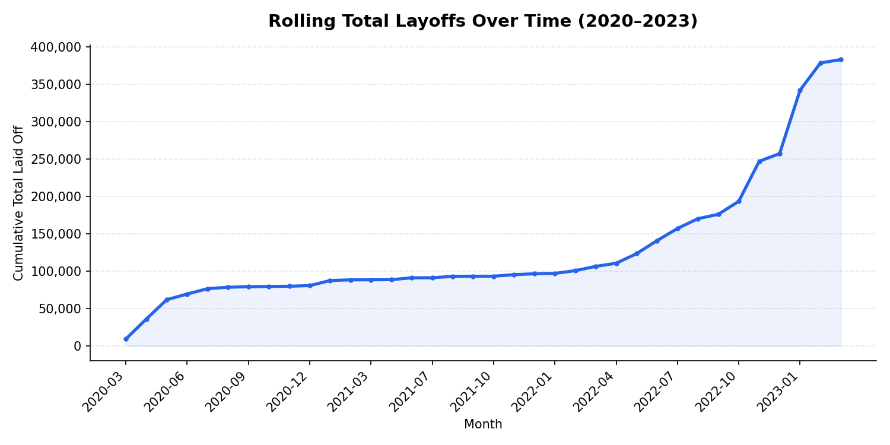
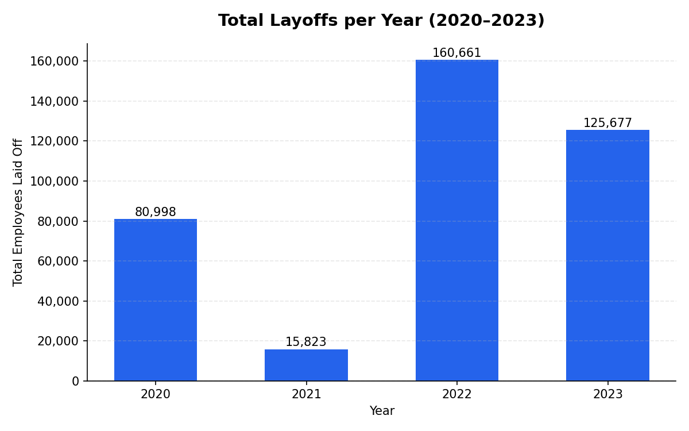
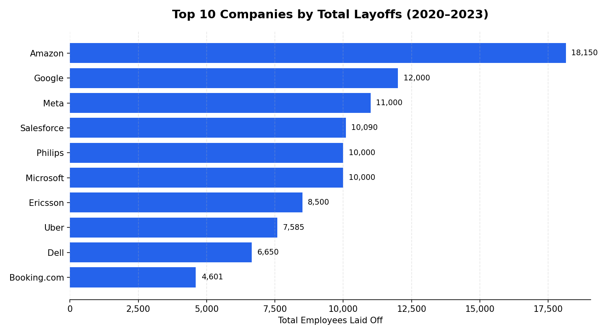

# 📊 Tech Layoffs Data Cleaning & Exploratory Data Analysis

Project ini melakukan **data cleaning** dan **exploratory data analysis (EDA)** menggunakan **MySQL** terhadap dataset PHK (layoffs) perusahaan teknologi global periode Maret 2020 – Maret 2023. Tujuannya untuk menemukan pola dan tren PHK berdasarkan waktu, industri, perusahaan, dan tahap pendanaan perusahaan.

---

## 🛠️ Tools yang Digunakan

- **MySQL** — data cleaning & exploratory data analysis
- **MySQL Workbench** — SQL editor
- **Excel / Google Sheets** — export & pengecekan data

---

## 📂 Dataset

Dataset mentah bersumber dari Kaggle, author hanya memakai sebagian dataset sesuai dengan periode COVID-19:
👉 [Layoffs Dataset Lengkap(Kaggle)](https://www.kaggle.com/datasets/swaptr/layoffs-2022)
👉 [Layoffs Dataset yang Digunakan di Project](https://drive.google.com/drive/folders/1Dabge-V2NwCTqXX2s8GejgjZGZlqGDuh?usp=drive_link)


---

## 📁 Struktur Folder

```
layoffs-data-analysis/
├── README.md
├── sql/
│   ├── 01_data_cleaning.sql
│   └── 02_data_exploratory_analysis.sql
└── images/
    ├── rolling_total_chart.png
    ├── total_per_year_chart.png
    └── top10_companies_chart.png
```

---

## 🧹 Data Cleaning

Proses cleaning dilakukan terhadap raw data dengan tahapan berikut (lihat detail di [`sql/01_data_cleaning.sql`](sql/01_data_cleaning.sql)):

1. **Remove Duplicates** — menghapus baris duplikat menggunakan `ROW_NUMBER()` dengan `PARTITION BY` seluruh kolom relevan
2. **Standardize the Data** — trim whitespace, menyeragamkan penulisan industri (mis. variasi `Crypto%`), menghapus tanda titik di akhir nama negara, serta konversi kolom `date` dari teks menjadi tipe `DATE`
3. **Handle Null / Blank Values** — menyeragamkan blank string menjadi `NULL`, serta mengisi nilai `industry` yang kosong berdasarkan data company yang sama
4. **Remove Unnecessary Rows/Columns** — menghapus baris tanpa data `total_laid_off` maupun `percentage_laid_off`, serta membuang kolom bantu (`row_num`) yang sudah tidak diperlukan

---

## 🔍 Exploratory Data Analysis (EDA)

Seluruh query EDA tersedia di [`sql/02_data_exploratory_analysis.sql`](sql/02_data_exploratory_analysis.sql), mencakup analisis nilai ekstrem, tren waktu, perbandingan antar industri/stage, hingga ranking perusahaan per tahun menggunakan window function (`DENSE_RANK`, rolling `SUM() OVER()`).

### Key Insights

- **2022 adalah tahun dengan total PHK tertinggi** (160.661), diikuti 2023 (125.677) — meski data 2023 baru mencakup Januari–Maret. 2020 mencatat 80.998 (dampak awal pandemi), sementara 2021 jauh lebih rendah (15.823), menandakan periode pemulihan sebelum gelombang PHK kembali melonjak.
- **Januari 2023 adalah bulan dengan PHK terbanyak** sepanjang periode data (84.714 karyawan), hampir 3x lipat dibanding lonjakan awal pandemi pada April 2020 (26.710).
- **Rolling total menunjukkan dua fase lonjakan berbeda**: guncangan cepat di awal pandemi (Maret–Juni 2020), lalu fase melandai sepanjang pertengahan 2020–2021, sebelum melonjak jauh lebih tajam pada November 2022–Januari 2023 (dari 193.702 menjadi 342.196 hanya dalam 3 bulan).
- **Amazon mencatat total PHK terbanyak secara keseluruhan** (18.150), diikuti Google (12.000) dan Meta (11.000) — didominasi perusahaan teknologi besar (big tech), bukan startup.
- **Industri Consumer paling terdampak** (45.182), disusul Retail (43.613) dan Other (36.289) — industri yang bergantung pada belanja konsumen langsung tampak paling rentan.
- **Top perusahaan dengan PHK terbanyak bergeser tiap tahun**: Uber memimpin di 2020, Bytedance di 2021, Meta di 2022, dan Google di 2023 — menunjukkan gelombang PHK berpindah dari sektor travel/consumer (awal pandemi) ke big tech (resesi 2022–2023). Amazon konsisten masuk top 5 di 2022 dan 2023, menandakan PHK yang berkelanjutan, bukan satu kali kejadian.

### ⚠️ Catatan Keterbatasan Data
Terdapat sebagian kecil baris (±500 dari total data) dengan nilai `date` yang tidak dapat di-parse dari data mentah, sehingga dikategorikan sebagai `NULL` saat proses cleaning. Baris-baris ini tidak diikutsertakan dalam analisis berbasis waktu (per bulan/tahun).

---

## 📈 Visualisasi

**Rolling Total Layoffs (2020–2023)**


**Total Layoffs per Year**


**Top 10 Companies by Total Layoffs**


---

## 🔧 Cara Reproduce

1. Buat database baru di MySQL
2. Import file `layoffs_aftercleaning.csv` ke dalam tabel bernama **`layoffs_staging2`**
   (bisa menggunakan *Table Data Import Wizard* di MySQL Workbench)
3. Jalankan query eksplorasi di [`sql/02_data_exploratory_analysis.sql`](sql/02_data_exploratory_analysis.sql)

> Jika ingin mereproduksi proses cleaning dari data mentah, jalankan [`sql/01_data_cleaning.sql`](sql/01_data_cleaning.sql) menggunakan dataset asli dari Kaggle di atas.

---

